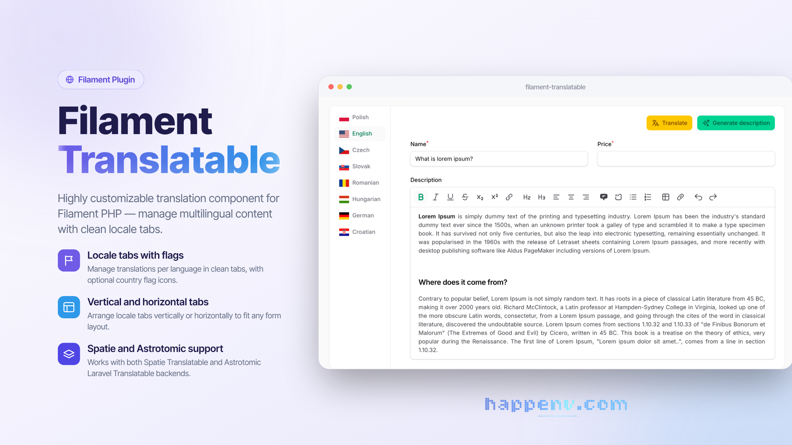

# Filament Translatable

<div class="filament-hidden">



</div>

[](https://github.com/happenv-com/filament-translatable/releases)
[](https://github.com/happenv-com/filament-translatable/actions/workflows/tests.yml)
[](https://github.com/happenv-com/filament-translatable/actions/workflows/phpstan.yml)
[](https://github.com/happenv-com/filament-translatable/actions/workflows/quality.yml)
[](https://packagist.org/packages/happenv-com/filament-translatable)
[](LICENSE.md)

**Filament Translatable** is a flexible package that provides a complete solution for managing multilingual content in [Filament](https://filamentphp.com) admin panels. It allows you to easily create translatable form fields with an intuitive tabbed interface, supporting multiple locales and translation packages.

```php
use Filament\Forms\Components\TextInput;

TextInput::make('name')
    ->translatable()
```

## Key features

- **Multiple translation backends** — supports both [spatie/laravel-translatable](https://github.com/spatie/laravel-translatable) and [astrotomic/laravel-translatable](https://github.com/astrotomic/laravel-translatable)
- **Two usage modes** — use the quick `translatable()` macro on any field, or the full `Translations` component for advanced scenarios
- **Locale tabs with flags** — display translations in horizontal or vertical tabs with optional country flag icons
- **Flexible locale configuration** — define locales globally or per-component, with custom labels
- **Required locale validation** — mark fields as required for specific locales or only for the default locale
- **Field decoration per locale** — customize field appearance (prefix, suffix, etc.) for each language
- **Custom actions per tab** — add custom Filament actions to each locale tab with access to the current locale
- **Include or exclude fields from translation** — selectively control which fields are translated
- **Prefix/suffix locale labels** — optionally add locale indicators to field labels

<picture>
  <source media="(prefers-color-scheme: dark)" srcset="https://raw.githubusercontent.com/happenv-com/filament-translatable/refs/heads/v3/screenshots/component-dark.png">
  <source media="(prefers-color-scheme: light)" srcset="https://raw.githubusercontent.com/happenv-com/filament-translatable/refs/heads/v3/screenshots/component-light.png">
  
</picture>

## Requirements

| Package  | Versions  |
| -------- | --------- |
| PHP      | 8.3 – 8.5 |
| Laravel  | 12, 13    |
| Filament | 4, 5      |

Translations are stored by [spatie/laravel-translatable](https://github.com/spatie/laravel-translatable) (default) or [astrotomic/laravel-translatable](https://github.com/astrotomic/laravel-translatable) — install the one you use.

| Filament Version | Filament Translatable Version    |
| ---------------- | -------------------------------- |
| 4.x              | 5.x (current), 4.x (maintenance) |
| 5.x              | 5.x (current), 4.x (maintenance) |

Filament 3 is not supported by any version of this package.

## Installation

You can install the package via composer:

```bash
composer require happenv-com/filament-translatable
```

Publish the assets:

```bash
php artisan filament:assets
```

Optionally, register the plugin in your panel provider to configure the package per panel (see [Where settings come from](#where-settings-come-from)):

```php
use Happenv\FilamentTranslatable\FilamentTranslatablePlugin;

public function panel(Panel $panel): Panel
{
    return $panel
        // ...
        ->plugin(FilamentTranslatablePlugin::make());
}
```

## Configuration

### Translation backends

#### With `spatie/laravel-translatable`

The [Spatie](https://github.com/spatie/laravel-translatable) package is the default translation backend. Follow the instructions in the [Spatie documentation](https://github.com/spatie/laravel-translatable/?tab=readme-ov-file#a-trait-to-make-eloquent-models-translatable) to properly configure your models.

#### With `astrotomic/laravel-translatable`

The [Astrotomic](https://github.com/astrotomic/laravel-translatable) package is an alternative translation backend.

Follow the [Astrotomic documentation](https://docs.astrotomic.info/laravel-translatable/installation#models) to configure your models using the original `Astrotomic\Translatable\Translatable` trait — no custom trait is needed. The component loads each locale's value from the record itself and saves it using Astrotomic's `title:en` attribute format.

When using the Astrotomic package, configure the plugin to use Astrotomic mode:

```php
use Happenv\FilamentTranslatable\Enums\TranslationMode;

FilamentTranslatablePlugin::make()
    ->translationMode(TranslationMode::Astrotomic)
```

You can also configure `translationMode` per component:

```php
 Translations::make('translations')
    ->translationMode(TranslationMode::Astrotomic)
```

Or per field (after `translatable()` you configure the `Translations` component):

```php
TextInput::make('name')
    ->translatable()
    ->translationMode(TranslationMode::Astrotomic)
```

`translationMode()` accepts `TranslationMode::Spatie`, `TranslationMode::Astrotomic` or your own implementation of `Happenv\FilamentTranslatable\Drivers\TranslationDriver`.

### Where settings come from

The plugin is optional — the `Translations` component also works in plain Livewire components and in panels without the plugin. Settings are resolved from weakest to strongest:

1. Package defaults: `app.fallback_locale` as the only locale and the default locale, Spatie mode, locale names shown, flags hidden, `24px` flags.
2. The plugin registered on the **current** panel.
3. `Translations::configureUsing()`, e.g. in a service provider:

```php
use Happenv\FilamentTranslatable\Forms\Component\Translations;

Translations::configureUsing(fn (Translations $translations) => $translations
    ->locales(['en' => 'English', 'pl' => 'Polski'])
    ->defaultLocale('en'));
```

4. Methods called on the component instance.

Every setting accepts a value or a `Closure`.

### Setting translatable locales

To set up the locales that can be used to translate content, pass an array of locales to the `locales()` plugin method:

```php
FilamentTranslatablePlugin::make()
     ->locales(['en', 'pl', 'fr']),
```

You can set locale labels using key => value array:

```php
FilamentTranslatablePlugin::make()
    ->locales([
        'pl' => __('Polish'),
        'en' => __('English')
    ])
```

Also, you can pass a Closure:

```php
FilamentTranslatablePlugin::make()
    ->locales(fn () => Language::pluck('code', 'name'))
```

### Setting default locale

You can set the default locale using the `defaultLocale()` method:

```php
FilamentTranslatablePlugin::make()
     ->defaultLocale('pl'),
```

Otherwise, the `app.fallback_locale` config value will be used.

### Enable or disable flags in locale labels

You can enable or disable flags in locale labels (disabled by default):

```php
FilamentTranslatablePlugin::make()
    ->displayFlagsInLocaleLabels(true)
```

### Setting flag width

You can set the flag width using:

```php
FilamentTranslatablePlugin::make()
    ->flagWidth('24px')
```

### Enable or disable names in locale labels

You can enable or disable locale names in locale labels (enabled by default):

```php
FilamentTranslatablePlugin::make()
    ->displayNamesInLocaleLabels(false)
```

### Publishing the views

To publish the views, run:

```bash
php artisan vendor:publish --tag="filament-translatable-views"
```

## Usage

### `translatable()` macro

The `translatable()` macro allows you to quickly convert any [form field](https://filamentphp.com/docs/4.x/forms/fields/getting-started) into a multilingual field that supports translations for each configured locale.

```php
use Filament\Forms\Components\TextInput;

TextInput::make('name')
    ->translatable()
```

<picture>
  <source media="(prefers-color-scheme: dark)" srcset="https://raw.githubusercontent.com/happenv-com/filament-translatable/refs/heads/v3/screenshots/macro-dark.png">
  <source media="(prefers-color-scheme: light)" srcset="https://raw.githubusercontent.com/happenv-com/filament-translatable/refs/heads/v3/screenshots/macro-light.png">
  
</picture>

#### Marking a field as required for a specific locale

You can make a field required only for specific locales. In this example, the "name" field will only be required for the English language:

```php
use Filament\Forms\Components\TextInput;

TextInput::make('name')
    ->requiredLocale('en')
    ->translatable()
```

#### Marking a field as required for the default locale

You can make a field required only for the default locale. The default locale is determined by the `defaultLocale()` setting or the `app.fallback_locale` config value:

```php
use Filament\Forms\Components\TextInput;

TextInput::make('name')
    ->requiredDefaultLocale()
    ->translatable()
```

Both `requiredLocale()` and `requiredDefaultLocale()` accept a condition as a boolean or a `Closure`:

```php
TextInput::make('name')
    ->requiredDefaultLocale(fn (): bool => auth()->user()->isEditor())
    ->translatable()
```

#### Decorating language-specific fields

You can customize the appearance of fields for specific locales using the `decorateTranslationField()` method. This is useful for adding locale-specific prefixes, suffixes, or other modifications. The decorator can also receive the locale code as `$locale`:

```php
use Filament\Forms\Components\TextInput;

TextInput::make('price')
    ->decorateTranslationField('pl', fn (TextInput $field) => $field->suffix('PLN'))
    ->decorateTranslationField('en', fn (TextInput $field, string $locale) => $field->prefix('USD'))
    ->translatable()
```

#### Passing options to `translatable()`

Use named arguments to set the locales or configure the generated `Translations` component:

```php
use Filament\Forms\Components\TextInput;
use Happenv\FilamentTranslatable\Forms\Component\Translations;

TextInput::make('title')->translatable(
    locales: ['en', 'pl'],
    configureUsing: fn (Translations $translations) => $translations->vertical(),
);
```

When `locales` is omitted, the locales configured by the plugin or `configureUsing()` are used.

#### Customizing `Translations` component

After using the `translatable()` method, the context of the field is switched to the `Translations` component, so you can use any method that belongs to the component.

```php
use Filament\Forms\Components\TextInput;

TextInput::make('price')
    ->requiredDefaultLocale()
    ->translatable() // Here context is switched from TextInput to Translations component
    ->vertical()
    ->displayFlagsInLocaleLabels(true)
    ->displayNamesInLocaleLabels(false)
    ->flagWidth('48px')
```

<picture>
  <source media="(prefers-color-scheme: dark)" srcset="https://raw.githubusercontent.com/happenv-com/filament-translatable/refs/heads/v3/screenshots/macro2-dark.png">
  <source media="(prefers-color-scheme: light)" srcset="https://raw.githubusercontent.com/happenv-com/filament-translatable/refs/heads/v3/screenshots/macro2-light.png">
  
</picture>

> [!CAUTION]
> Be sure to set field-specific methods like `required()` or `requiredDefaultLocale()` **before** calling the `translatable()` method.

### `Translations` component

The `Translations` component provides a more powerful way to configure multiple [form fields](https://filamentphp.com/docs/4.x/forms/fields/getting-started) for multilingual support. It displays translations in a tabbed interface, with each tab representing a different locale.

```php
use Happenv\FilamentTranslatable\Forms\Component\Translations;

Translations::make('translations') // name is required to properly handle actions
    ->schema([
        TextInput::make('name')
    ])
```

<picture>
  <source media="(prefers-color-scheme: dark)" srcset="https://raw.githubusercontent.com/happenv-com/filament-translatable/refs/heads/v3/screenshots/horizontal-component-dark.png">
  <source media="(prefers-color-scheme: light)" srcset="https://raw.githubusercontent.com/happenv-com/filament-translatable/refs/heads/v3/screenshots/horizontal-component-light.png">
  
</picture>

> [!NOTE]
> Using the `translatable()` method within the `Translations` component is not needed.

> [!IMPORTANT]
> Be sure to set different names for each `Translations` component when using multiple instances.

#### Setting the translatable locales for specific components

By default, locales are configured globally in the plugin settings. However, you can override the locales for a specific `Translations` component:

```php
Translations::make('translations')
    ->locales(['en', 'es'])
```

#### Setting custom field labels per locale

You can customize field labels for each locale using the `fieldTranslatableLabel()` method. This is useful for translating field labels themselves. In all closures of this package `$locale` is the locale code (a `string`):

```php
use Filament\Forms\Components\Field;
use Happenv\FilamentTranslatable\Forms\Component\Translations;

 Translations::make()
    ->schema([
        // Fields
    ])
    ->fieldTranslatableLabel(fn (Field $field, string $locale) => __($field->getName(), locale: $locale))
```

#### Adding prefix/suffix locale labels to fields

You can add the locale name as a prefix or suffix to field labels using the `prefixLocaleLabel()` or `suffixLocaleLabel()` methods. This helps users identify which language they are editing:

```php
use Happenv\FilamentTranslatable\Forms\Component\Translations;

Translations::make('translations')
    ->schema([
        // Fields
    ])
    ->prefixLocaleLabel()
    ->suffixLocaleLabel()
```

#### Customizing the locale label format

By default, the prefix/suffix locale label is the locale label enclosed in parentheses (e.g., "(English)"). You can customize this format using the `formatLocaleLabelUsing()` method:

```php
use Happenv\FilamentTranslatable\Forms\Component\Translations;

Translations::make('translations')
    ->formatLocaleLabelUsing(fn (string $locale, string $label) => "[{$label}]");
```

#### Conditionally adding locale labels

You can conditionally add prefix/suffix labels by injecting the `$field` parameter into the callback. This allows you to apply locale labels only to specific fields:

```php
use Filament\Forms\Components\Field;
use Happenv\FilamentTranslatable\Forms\Component\Translations;

Translations::make('translations')
    // ...
    ->prefixLocaleLabel(function(Field $field) {
        // Must return a boolean value
        return $field->getName() == 'title';
    })
    ->suffixLocaleLabel(function(Field $field) {
        // Must return a boolean value
        return $field->getName() == 'title';
    })

```

#### Adding actions to locale tabs

You can add custom Filament actions to each locale tab using the `actions()` method. Actions appear in the tab header and can be used for operations like auto-translation or copying content between locales:

```php

use Filament\Actions\Action;
use Happenv\FilamentTranslatable\Forms\Component\Translations;

Translations::make('translations')
    ->actions([
        Action::make('fillDumpTitle')
    ])
```

#### Accessing the locale in actions

To access the current locale within an action, use the `$arguments` parameter and retrieve the `locale` value:

```php

use Filament\Actions\Action;
use Happenv\FilamentTranslatable\Forms\Component\Translations;

Translations::make('translations')
    ->actions([
        Action::make('fillDumpTitle')
            ->action(function (array $arguments) {
                $locale = $arguments['locale'];
                // ...
            })
    ])
```

#### Accessing the locale in schema

You can access the current locale within the schema definition by defining a `$locale` parameter. This is useful for conditional logic based on the locale:

```php

use Filament\Forms\Components\TextInput;
use Happenv\FilamentTranslatable\Forms\Component\Translations;

Translations::make()
    ->schema(fn (string $locale) => [TextInput::make('title')->required($locale == 'en')])
```

#### Removing the styled container

By default, the `Translations` component is wrapped in a card-styled container. You can remove this styling using the `contained()` method:

```php
use Happenv\FilamentTranslatable\Forms\Component\Translations;

Translations::make()
    ->contained(false)
```

#### Vertical tabs

You can display translations as vertical tabs:

```php
use Happenv\FilamentTranslatable\Forms\Component\Translations;

Translations::make()
    ->vertical()
```

#### Overriding plugin settings per component

You can override the global plugin settings directly on individual components:

```php
use Happenv\FilamentTranslatable\Forms\Component\Translations;

Translations::make()
    ->displayNamesInLocaleLabels(false)
    ->displayFlagsInLocaleLabels(true)
    ->flagWidth('48px')
```

#### Excluding fields from translation

The `exclude()` method allows you to specify fields that should not be translated. Excluded fields will appear in the form but will not be duplicated for each locale. This is useful for fields that contain non-translatable content:

```php
use Happenv\FilamentTranslatable\Forms\Component\Translations;

Translations::make('translations')
    ->schema([
        Forms\Components\TextInput::make('title'),
        Forms\Components\TextInput::make('description'),
    ])
    ->exclude(['description'])
```

Without `exclude`:

```json
{
    "title": {
        "en": "Dump",
        "es": "Dump",
        "fr": "Dump"
    },
    "description": {
        "en": null,
        "es": null,
        "fr": null
    }
}
```

With `exclude`:

```json
{
    "title": {
        "en": "Dump",
        "es": "Dump",
        "fr": "Dump"
    },
    "description": null
}
```

#### Including only specific fields for translation

The `include()` method allows you to specify which fields should be translated. This is useful when only a small subset of fields in a large form requires translations.

```php
use Happenv\FilamentTranslatable\Forms\Component\Translations;

Translations::make('translations')
    ->schema([
        Forms\Components\TextInput::make('title'),
        Forms\Components\TextInput::make('description'),
    ])
    ->include(['title'])
```

Without `include`:

```json
{
    "title": {
        "en": "Dump",
        "es": "Dump",
        "fr": "Dump"
    },
    "description": {
        "en": null,
        "es": null,
        "fr": null
    }
}
```

With `include(['title'])`:

```json
{
    "title": {
        "en": "Dump",
        "es": "Dump",
        "fr": "Dump"
    },
    "description": null
}
```

## Development

```bash
composer test          # unit and feature tests
composer phpstan       # static analysis
composer cs            # fix code style: composer normalize, Rector, Pint
composer ci            # everything CI checks, locally
```

The package's stylesheet is built by the Tailwind CLI from `resources/css/app.css` — with the utilities used in `resources/views` and `src` — into `resources/dist`, which is committed. After changing any of them, rebuild and commit the result — CI refuses outdated assets:

```bash
npm ci
npm run build   # or `npm run dev` to rebuild on change
npm run lint    # Prettier check, as in CI
```

## Upgrading

Breaking changes and how to migrate are described in [UPGRADING](UPGRADING.md) for every major version. Upgrading from 4.x? Start there.

## Changelog

See [CHANGELOG](CHANGELOG.md) and [GitHub releases](https://github.com/happenv-com/filament-translatable/releases) for what has changed recently.

## Contributing

See [CONTRIBUTING](.github/CONTRIBUTING.md) for details.

## Security vulnerabilities

Please review [our security policy](.github/SECURITY.md) on how to report security vulnerabilities.

## Credits

- [Happenv sp. z o.o.](https://happenv.com)
- [webard](https://github.com/webard)
- [Lipis](https://github.com/lipis/flag-icons) for icons
- [Solution Forest](https://github.com/solutionforest/filament-translate-field) for great inspiration
- [Outer Web](https://github.com/outer-web/filament-translatable-fields) for the macro idea
- [All contributors](../../contributors)

## License

The MIT License (MIT). See [License File](LICENSE.md) for more information.

---

<p align="center">
    <a href="https://happenv.com">
        
    </a>
</p>
